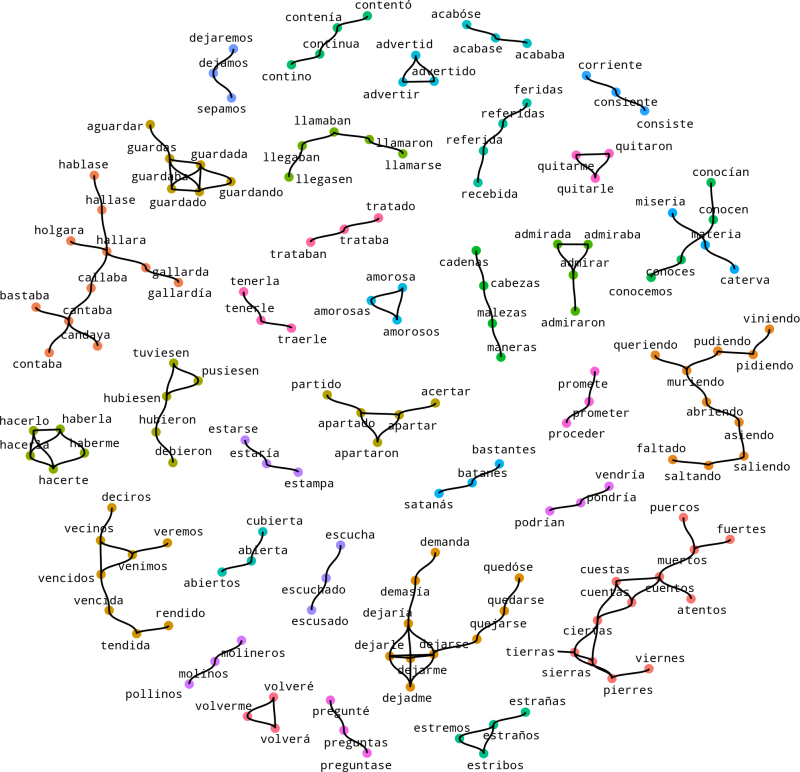

<!-- README.md is generated from README.Rmd. Please edit that file -->

```{r, echo = FALSE}
knitr::opts_chunk$set(
  collapse = TRUE,
  comment = "#>",
  fig.path = "man/figures/README-",
  gganimate = list(
    nframes = 50
  )
)
```

# clustringr

`clustringr` clusters a vector of strings into groups where strings have small mutual "edit distance" (see `stringdist`). Internally it uses one of two graph algorithms: connected components, or edge-betweeness, from the `igraph` package.

## Usage

In the example below a vector of 9 strings is clustered into 4 groups. The results come in the `df_clusters` element returned by cluster_strings_cc(), which uses the connected components algorithm. Notice that for every input string, a `cluster` id along with cluster `size` is supplied in `df_cluster`. Duplicates, left, right, and repeated spacing are automatically eliminated from the input vector.

```{r, message=FALSE}
library(clustringr)
s_vec <- c("alcool",
           "alcohol",
           "alcoholic",
           "brandy",
           "brandie",
           "cachaça",
           "whisky",
           "whiskie",
           "whiskers")
cluster_strings_cc(s_vec)$df_clusters
```

To use the edge-betweeness algorithm (slightly more robust with respect to breaking long transitive chains):

```{r}
cluster_strings_eb(s_vec)$df_clusters
```

## Cluster Visualization

Below is a graph of non-singleton clusters computed from some 300 spanish words sampled from Miguel de Cervantes' [Don Quijote](http://www.gutenberg.org/cache/epub/2000/pg2000.txt).

```{r,echo=F}

```

Visualization code not yet exported.

# Installation

Currently a development version is available on github. 

```{r,eval=F}
# install.packages('devtools')
devtools::install_github('dan-reznik/clustringr')
```
