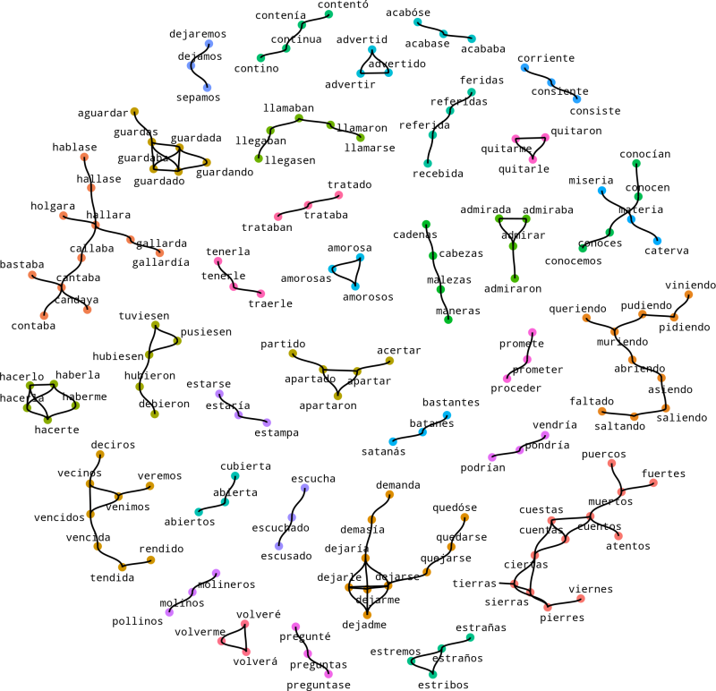

<!-- README.md is generated from README.Rmd. Please edit that file -->
clustringr
==========

`clustringr` clusters a vector of strings into groups where strings have small mutual "edit distance" (see `stringdist`). Internally it uses one of two graph algorithms: connected components, or edge-betweeness, from the `igraph` package.

Usage
-----

In the example below a vector of 9 strings is clustered into 4 groups. The results come in the `df_clusters` element returned by cluster\_strings\_cc(), which uses the connected components algorithm. Notice that for every input string, a `cluster` id along with cluster `size` is supplied in `df_cluster`. Duplicates, left, right, and repeated spacing are automatically eliminated from the input vector.

``` r
library(clustringr)
s_vec <- c("alcool",
           "alcohol",
           "alcoholic",
           "brandy",
           "brandie",
           "cachaça",
           "whisky",
           "whiskie",
           "whiskers")
cluster_strings_cc(s_vec)$df_clusters
#> # A tibble: 9 x 3
#>   cluster  size node     
#>     <int> <int> <chr>    
#> 1       1     3 alcohol  
#> 2       1     3 alcoholic
#> 3       1     3 alcool   
#> 4       2     3 whiskers 
#> 5       2     3 whiskie  
#> 6       2     3 whisky   
#> 7       3     2 brandie  
#> 8       3     2 brandy   
#> 9       4     1 cachaça
```

To use the edge-betweeness algorithm (slightly more robust with respect to breaking long transitive chains):

``` r
cluster_strings_eb(s_vec)$df_clusters
#> # A tibble: 9 x 3
#>   cluster  size node     
#>     <int> <int> <chr>    
#> 1       1     3 alcohol  
#> 2       1     3 alcoholic
#> 3       1     3 alcool   
#> 4       2     3 whiskers 
#> 5       2     3 whiskie  
#> 6       2     3 whisky   
#> 7       3     2 brandie  
#> 8       3     2 brandy   
#> 9       4     1 cachaça
```

Cluster Visualization
---------------------

Below is a graph of non-singleton clusters computed from some 300 spanish words sampled from Miguel de Cervantes' [Don Quijote](http://www.gutenberg.org/cache/epub/2000/pg2000.txt).



Visualization code not yet exported.

Installation
============

Currently a development version is available on github.

``` r
# install.packages('devtools')
devtools::install_github('dan-reznik/clustringr')
```
