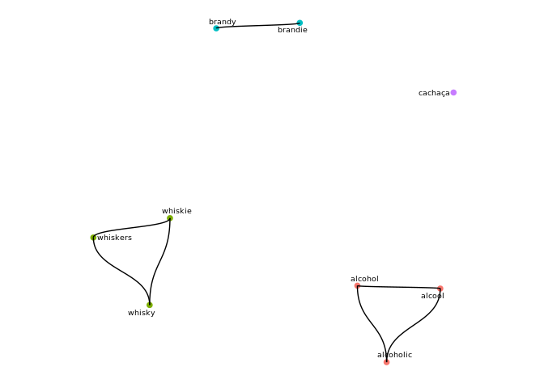
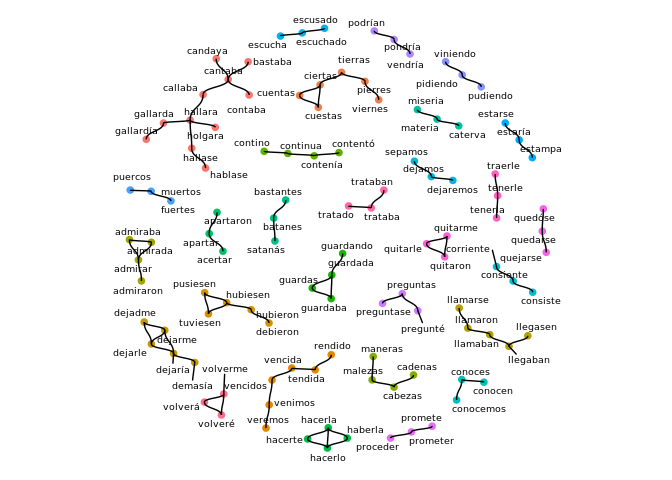

<!-- README.md is generated from README.Rmd. Please edit that file -->
clustringr
==========

`clustringr` clusters a vector of strings into groups of small mutual "edit distance" (see `stringdist`), using graph algorithms. Notice it's unsupervised, i.e., you do not need to pre-specify cluster count. Graph visualization of the results is provided.

Installation
============

Currently a development version is available on github.

``` r
# install.packages('devtools')
devtools::install_github('dan-reznik/clustringr')
```

Usage
-----

In the example below a vector of 9 strings is clustered into 4 groups by levenshtein distance and connected components. The call to `cluster_strings()` returns a list w/ 3 elements, the last of which is `df_clusters` which associates to every input string a `cluster`, along with its cluster `size`.

``` r
library(clustringr)
s_vec <- c("alcool",
           "alcohol",
           "alcoholic",
           "brandy",
           "brandie",
           "cachaça",
           "whisky",
           "whiskie",
           "whiskers")
s_clust <- cluster_strings(s_vec # input vector
                           ,clean=T # dedup and squish
                           ,method="lv" # levenshtein
                           # use: method="dl" (dam-lev) or "osa" for opt-seq-align
                           ,max_dist=3 # max edit distance for neighbors
                           ,algo="cc" # connected components
                           # use algo="eb" for edge-betweeness
)
s_clust$df_clusters
#> # A tibble: 9 x 3
#>   cluster  size node     
#>     <int> <int> <chr>    
#> 1       1     3 alcohol  
#> 2       1     3 alcoholic
#> 3       1     3 alcool   
#> 4       2     3 whiskers 
#> 5       2     3 whiskie  
#> 6       2     3 whisky   
#> 7       3     2 brandie  
#> 8       3     2 brandy   
#> 9       4     1 cachaça
```

Cluster Visualization
---------------------

To view a graph of the clusters, simply pass the structure returned by `cluster_strings` to `cluster_plot`:

``` r
cluster_plot(s_clust
             ,min_cluster_size=1
             # ,label_size=2.5 # size of node labels
             # ,repel=T # whether labels should be repelled
             )
#> Using `nicely` as default layout
```



Supplied Data Set: Don Quijote's unique words
---------------------------------------------

The `clustringr` package comes with `quijote_words`, a ~22k row data frame of the unique words in Cervantes' [Don Quijote](http://www.gutenberg.org/cache/epub/2000/pg2000.txt). From this word set we will sample a subset:

``` r
library(dplyr)
quijote_words_filtered <- clustringr::quijote_words %>%
  # only terms which appear # times
  filter(between(freq,8,11),len>6) %>%
  pull("word")
quijote_words_filtered%>%length
#> [1] 602
```

To view these as a graph, showing only those clusters with at least 3 elements:

``` r
quijote_words_filtered %>%
  cluster_strings(method="lv",max_dist=2) %>%
  cluster_plot(min_cluster_size=3)
```



Happy clustering!
